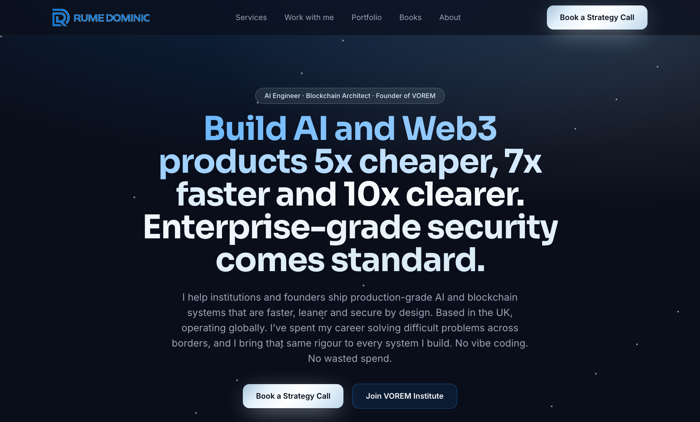

# rumedominic.com

**A production-grade personal brand and lead-generation platform for Rume Dominic — AI engineer, blockchain architect, and founder of VOREM.**

[](https://rumedominic.com)
[](https://nextjs.org)
[](https://www.typescriptlang.org)
[](#quality-and-engineering-standards)
[](LICENSE)

<p align="center">
  <a href="https://rumedominic.com">
    
  </a>
</p>

<p align="center"><strong><a href="https://rumedominic.com">View the live site &rarr;</a></strong></p>

---

## What this is

A fast, accessible, conversion-focused website that turns visitors into qualified leads for a high-trust AI and Web3 consultancy. It is not a template or a demo. It runs in production on a live domain, captures real leads into a database, sends branded automated email, and is built to the same "no vibe coding" engineering standard the business is known for: spec-first, strictly tested, and observable.

It also ships with **Growth Brain**, a self-improving analytics and AI decision layer that instruments the funnel and turns the data into ranked, human-approved growth recommendations.

## Highlights

- **Full lead pipeline** — capture on the site, persisted to Supabase, synced to the email platform, and delivered a branded confirmation, all in one request.
- **Gated lead magnet** — a `/framework` landing page that exchanges a downloadable PDF field guide for an email, entering the visitor into the pipeline.
- **Productized offer section** — a clear, tiered "Work with me" offer built on a patent-pending AI assurance standard.
- **Branded transactional email** — one reusable email shell (logo header, corporate footer) so every message looks like a single enterprise brand.
- **AI decision layer** — Growth Brain reads the funnel metrics and uses Claude to propose the next best move each week, inside strict governance.
- **SEO / AEO / GEO ready** — JSON-LD (Person, Organization, Book, FAQ), sitemap, robots, and a dynamically generated Open Graph image.

## Tech stack

| Layer | Technology |
|---|---|
| Framework | Next.js 14 (App Router), React 18, TypeScript |
| Styling | Tailwind CSS, custom design system |
| Data | Supabase (PostgREST) for the lead store |
| Email / CRM | Brevo (transactional email + contacts) |
| AI layer | Anthropic Claude (Growth Brain recommendations) |
| Testing | Vitest + React Testing Library (45 tests) |
| CI/CD | GitHub Actions, Vercel |
| Analytics | Vercel Analytics + a typed `track()` event layer |

## Architecture

A typed content layer (`content/*.ts`) is the single source of truth for every section; presentational components render from it, so copy and data never live inside JSX. Server-side route handlers (`app/api/*`) own all secrets and third-party calls, and each one degrades gracefully — the site works before any external service is configured. See [`ARCHITECTURE.md`](ARCHITECTURE.md) for the full picture.

```
app/            Routes, API handlers, layout, dynamic OG image
components/      Presentational UI (renders from the content layer)
content/         Typed content — the single source of truth
lib/             Server utilities: supabase, brevo, email, validation, analytics
growth-brain/    Self-improving analytics + AI decision layer
__tests__/       Vitest + Testing Library suite
```

## Quality and engineering standards

- **45 automated tests** across validation, API handlers, email, content schema, and UI, run in CI on every push.
- **`npm run verify`** gates typecheck, tests, and a production build together.
- **Lighthouse:** Performance 95+, Accessibility 100, Best Practices 100, SEO 100.
- **Performance-first:** lazy-loaded third-party embeds, no render-blocking animation libraries, visibility-paused canvas.
- **Security-conscious:** secrets are server-only, inputs validated with zod, form honeypots, and no key ever reaches the client bundle.

## Quick start

```bash
cp .env.example .env.local     # fill in the values you have
npm install
npm run dev                    # http://localhost:4010
```

| Command | What it does |
|---|---|
| `npm run dev` | Local dev server |
| `npm run build` | Production build |
| `npm run typecheck` | `tsc --noEmit` |
| `npm run test` | Vitest suite (45 tests) |
| `npm run verify` | Typecheck + tests + build |

## About

Built and maintained by **O'Rume Dominic Uririe (Rume Dominic)** — AI engineer, blockchain architect, and founder of VOREM. He holds an MSc in Artificial Intelligence (Aston University) and has filed a UK Intellectual Property Office patent application (GB2611754.9) for a framework on provable, auditable, and accountable AI. Based in the UK, operating globally.

- Website: [rumedominic.com](https://rumedominic.com)
- Newsletter: *Know Your AgenticAi*

## License

[MIT](LICENSE)
