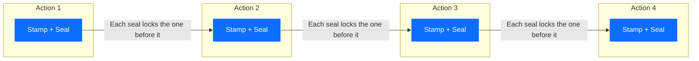

# THE KYA METHOD
**The Complete Build Standard for Trustworthy AI Systems**

*Promise it. Attack it. Inspect it. Prove it.*

**Rume Dominic**
Creator of the KYA Framework · UK patent pending

*Creating is my trade; teaching is what creating obliges.*

---

## The Big Idea

Two AI systems can look exactly the same in a demo. Both run. Both impress the room. But one falls apart the first time something real goes wrong — a data format changes, a service goes down, a user does something nobody expected. The other stands.

**The difference is never visible in the demo. It is in the discipline underneath.**

The KYA Method is that discipline, written down so anyone can run it. It is four steps, done in order, every time:

1. **PROMISE:** Write the rules before the code.
2. **ATTACK:** Try to break it before you build it.
3. **INSPECT:** Thirteen checks. No score, no shipping.
4. **PROVE:** Stamp every action so anyone can check.

And one rule holds all four together: **the AI suggests, the human decides.** Your AI tools can propose a thousand ideas a day. Only you decide what becomes real. Nothing ships because it looks right. Things ship because they passed.

---

## Step 1 — Promise
**Write the rules before the code.**

Most builds start with typing. Ours start with writing. Before a single line of code, you write down the promise your system makes: what it must always do, what it must never do, and what finished means. Not in your head. Not in a chat you will lose. In plain files that live inside the project itself.

### The folders are the plan
Break the work into stages, and give every stage its own folder. Inside each folder sits one short file — the job card — that answers four questions: what comes in, what you do with it, what goes out, and how you know the stage is done.

A rules file at the top governs the whole project: the promises, the forbidden actions, and which stage handles which job. When your AI assistant works on the project, it reads the rules first, then the job card for its stage — and nothing else. The plan travels with the code, forever, readable by any person or any AI that opens the folder.

### The one-page law
Every job card fits on one page. This is not a style choice — it is a test of understanding. If you cannot describe a stage in one page, the stage is too big: split it. If you cannot explain what you want to communicate in the simplest way, you do not yet understand it yourself. The one-page law forces the understanding before the building.

### The NOT list
Every rules file carries a second list, and it works harder than the first: what this stage must NOT look at. An AI given everything gets lost in everything — it reads slower, costs more, and drifts. An AI given only what the step needs works fast and stays sharp. Most builders only write down what to include. Champions write down what to exclude. Focus is designed, not hoped for.

### The working rules
Five habits keep the Promise honest day to day:
1. **One source of truth** — a fact lives in one place, never copied.
2. **One change at a time** — every change gets its own save point, so any mistake can be undone in seconds.
3. **Fail loudly** — if bad data arrives, the system stops and says so; it never quietly guesses.
4. **Same input, same output** — randomness is pinned down and recorded, so every run can be repeated exactly.
5. **Secrets stay outside** — passwords and keys never live in project files.

> [!IMPORTANT]
> **The test for Step 1:** could a stranger open your folders, read the files, and know exactly what the system promises — without asking you a single question? If yes, you have a Promise. If no, you have a wish.

---

## Step 2 — Attack
**Try to break it before you build it.**

A design everyone agrees with is a design nobody has tested. So before building, you attack your own plan — deliberately, from five directions. You do not need five people or five AIs. One AI, wearing five different hats, one at a time:

1. **The Planner:** *Is the shape right?* (Are the stages in the right order? Is anything missing?)
2. **The Builder:** *Can it be built?* (Can it actually be made with the tools and time you have?)
3. **The Thief:** *How do I steal from it?* (Steal data, trick the AI, misuse the product.)
4. **The Firefighter:** *What burns at 3 AM?* (What fails first under real load, and how would anyone know?)
5. **The Doubter:** *What are we assuming?* (Every "of course it will" is a place it might not.)

### Collect arguments, not answers
Here is the secret of the five hats: you are not looking for agreement. You are looking for the places they disagree — because disagreement marks exactly where your design carries hidden risk. Fix those places on paper, where a fix costs minutes. Not in production, where a fix costs customers.

### Build small, test three ways
Then build in small pieces — each piece with its own input, output, and pass condition. Every piece faces three tests, in order. 
1. **Does it work?** The piece does its own job correctly. 
2. **Does it connect?** The piece works with its neighbours. Nothing is real until it is connected; "it works on my machine" counts for nothing. 
3. **What happens when things go wrong?** This is the test most people skip. Cut the network in the middle of a run. Feed it broken data. Double the load. Watch what breaks and where the pieces land. Better you break it on a quiet Tuesday than a customer breaks it on launch day.

### Write down every shortcut
Real builds take shortcuts — that is fine. What is not fine is forgetting them. Keep one running list in the project: the shortcut, why you took it, and when it must be repaid. A written shortcut is a debt you will pay on your schedule. An unwritten shortcut is a trap you will step in on its schedule.

### Plan the 3 AM question now
Before shipping anything, answer one brutal question: if this breaks at 3 AM, can you find the cause in ten minutes? If the answer is no, you are missing logs, or measurements, or a clear trail of what the system did. Add them now, while it is cheap. Visibility is built in, never bolted on.

---

## Step 3 — Inspect
**The Thirteen Checks. No score, no shipping.**

Before anything ships, it faces a full inspection: thirteen checks that ask one question thirteen ways — is this a real system, or just a good-looking demo? Each check gets one of three honest grades.

**PASS:** it is built, and you can point to the exact file or mechanism that proves it. 
**GROWING:** started, not finished — name what is missing. 
**MISSING:** not there — fix it, or sign your name and a date to why it can wait. 
*Pointing is required: "we handle that" is talk, and talk is not evidence.*

Here are all thirteen, in plain words:

1. **The Written Rules:** Does the system behave the same way every run because its rules are written down — or differently every time because someone improvises?
2. **Plan Before Code:** Was the job card written before the code — or invented afterwards to describe whatever got built?
3. **Small Pieces:** Is the work broken into stages you can hold in your head — or is it one giant prompt doing everything?
4. **A Route, Not a Reflex:** Before working, does the AI write out its route — an ordered list of what it will do — and then follow it? Or does it just react to whatever is in front of it?
5. **Know What Done Means:** Does every stage have a finish line written down — or does work just stop when it feels finished?
6. **Feed It Only What It Needs:** Does each stage load only its own materials — or does everything get dumped into the AI every time?
7. **Contain the Fire:** If one stage crashes, does the damage stay inside its walls — or spread through the whole system?
8. **Show Your Working:** Can you replay how the AI reached its answer, step by step, after the fact? Or is the answer a black box?
9. **Fences That Hold:** Are the forbidden actions actually enforced by a checker that runs — or just written in a document and hoped for?
10. **Check Your Own Work:** Is output verified by something other than the thing that produced it?
11. **Say Where You Learned It:** When the system states a fact, can it show the source — or might it be making things up?
12. **Ship Through a Gate:** Does work reach production through an automatic pipeline that runs the tests, the fences, and this very inspection — or does someone copy files across by hand?
13. **Learn From Last Time:** Does run 101 know what run 100 got wrong — or does the system repeat itself forever?

### The inspection knows YOU
Every builder has favourite corners to cut. Some never write the route (check 4). Some never contain the fire (check 7). Some never keep the trail (check 8). The method keeps your personal list — the checks you habitually skip — and marks them as blockers that cannot be waved through without a signed, dated reason. Your blind spots are written down precisely so they stop being blind.

And the gate is a program, not a promise. A script runs this inspection and reads the scores. If a blocker stands open, the ship button does not work — no matter how good the demo looked, no matter how late it is. Discipline you cannot forget is the only discipline that lasts.

> **Scoreboard truth:** one or two passes make a demo. Thirteen passes — or honest, signed reasons for the gaps — make a system.

---

## Step 4 — Prove
**Stamp every action so anyone can check.**

This is the step the rest of the industry skips, and the reason the method carries the KYA name — **Know Your AI.** The first three steps build software that survives. This step builds software that can be believed.

### How the stamping works
Every important action the system takes — a stage finishing, a report going out, an AI making a decision, a certificate being issued — gets a stamp. The stamp records four things: what happened, when it happened, under which rule it happened, and who approved it (or the honest note that no one did).

Each stamp is then sealed with mathematics — a fingerprint computed from the record itself. Change one letter of the record and the fingerprint no longer matches: the tampering shows. And each seal is computed over the seal before it, so the stamps form a chain. Break any link, and every link after it visibly breaks too. For the records that matter most, the latest seal can also be anchored to a public ledger — a witness outside your own walls that even you cannot quietly rewrite.

### What ships with every artifact
Every published output carries its birth certificate: which version of the system made it, which snapshot of data it was made from, which settings were active, and who signed it off. Not buried in a log — attached to the artifact itself, where the person receiving it can see it.

### Why this changes everything
**A client asks: "did the AI really do what you say it did?" Most builders answer with *trust me*. You answer by handing over the chain — and they check it themselves, without needing to trust you at all. That is the rarest property in AI today: a system whose word you do not have to take.**

Accountability here is not a policy pasted on top of the system. It is a property built into the architecture — designed in at Step 1, delivered at Step 4. Not a lock — a witness.

---

## The Loop — and How to Start
The four steps are not a ladder you climb once. They are a wheel you turn every cycle.

Every turn of the wheel makes the rules sharper, pays down a written debt, closes an open check, and adds links to the proof chain. This is where speed truly comes from: not from skipping the discipline, but from the discipline removing the chaos that slows everyone else down.

### Start this week
**Day one:** take your current project and write the rules file — the promises, the forbidden actions, the NOT list. One page. 
**Day two:** split the work into stage folders, each with its one-page job card. 
**Day three:** run the five hats against your design and fix what they argue about. 
**Day four:** run the Thirteen Checks honestly and write your first scoreboard — expect gaps; every builder has them. 
**Day five:** add the first stamps to your most important action, and wire the gate so nothing ships unscored. 
From then on, turn the wheel.

### Who this is for
Any builder shipping AI into the real world — a founder with one product, a team inside an enterprise, a student turning research into tools. The method does not care how big you are. It cares whether your system can take a punch and prove its story afterwards.

### Standing on named shoulders
Honest builders credit their materials. The folder-first way of guiding AI grows from the **Interpretable Context Methodology** of Jake Van Clief and David McDermott. The thirteen-check inspection grew from the system-audit thinking of **Gabriel Millien**, with visual lineage to **Brij Kishore Pandey**. The attack-first loop belongs to the wider craft of systems engineering. What is mine is the fourth step — the proof layer, from my **KYA Framework (UK patent pending)** — and the welding of all four into one standard a builder can run every single day.

> **The whole method in four lines:**
> Write the promise before the code.
> Attack the plan before the build.
> Inspect the work before the ship.
> Stamp the actions so anyone can check.

*Rume Dominic is an AI and blockchain engineer, founder of Vorem, author of five books, and creator of the KYA Framework for verifiable AI accountability. He has trained 12,000+ learners across four continents. · [rumedominic.com](https://rumedominic.com)*
